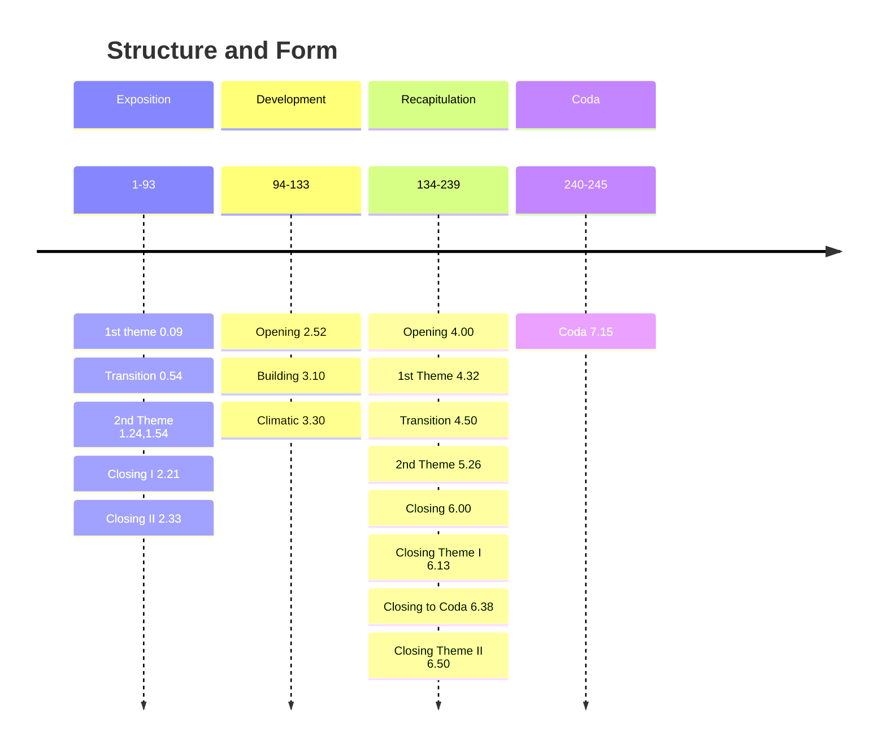

# Piano Sonata No. 1 in F minor, Op. 1 (1912)

Here’s an analysis of **Piano Sonata No. 1 in F minor, Op. 1 (1912)** by Sergei Prokofiev, formatted in Markdown:

## Overview

- **Composer**: Sergei Prokofiev
- **Key**: F minor
- **Opus**: Op. 1
- **Year of Composition**: 1907–1912
- **Duration**: Approximately 7–8 minutes
- **Form**: Single movement sonata
- **Dedication**: To Reinhold Glière, Prokofiev's early mentor and teacher.

Prokofiev's **Piano Sonata No. 1** is his first published work and represents his early compositional style. It is a relatively short, single-movement sonata that reflects the influence of Romantic composers like Rachmaninoff and Scriabin, while also hinting at Prokofiev's emerging individuality.

---

## Structure and Form (with Bar Numbers)



### 1. **Exposition** (Bars 1–93)

The exposition introduces two contrasting themes and establishes the tonal framework of the piece.

- **First Theme (Bars 5–25)**: 0:09

  - Key: F minor
  - A dramatic and stormy theme, characterized by sweeping arpeggios and a melancholic melody.
  - The theme is introduced in the left hand with a bold, declamatory style, while the right hand provides rapid arpeggios.

- **Transition (Bars 26–41)**: 0:54

  - Modulates from F minor to A-flat major (the relative major).
  - Features chromaticism and rhythmic drive, creating tension and anticipation for the second theme.

- **Second Theme (Bars 42–93)**: 1:24, 1:54

  - Key: A-flat major
  - A lyrical and contrasting theme, more delicate and introspective than the first.
  - The melody is smoother and more flowing, with a sense of calm and resolution.

- **Closing I (Bars 74–81)**: 2:21

- **Closing II (Bars 82–93)**: 2:33

---

### 2. **Development** (Bars 94–133)

The development section explores and transforms the material from the exposition.

- **Opening of Development (Bars 94–103)**: 2:52

  - Begins with fragments of the first theme, now more fragmented and chromatic.
  - Prokofiev uses dynamic contrasts and harmonic instability to create tension.

- **Virtuosic Passage (Bars 104–118)**: 3:10

  - Features rapid arpeggios and scales, showcasing the pianist's technical skill.
  - The harmonic language becomes more adventurous, with unexpected modulations.

- **Climatic Build (Bars 119–133)**: 3:30
  - The development reaches its dramatic peak with a powerful restatement of the first theme in a more intense and rhythmically driven form.
  - Leads seamlessly into the recapitulation.

---

### 3. **Recapitulation** (Bars 134–240) 4:00

The recapitulation restates the themes from the exposition, now resolved in the home key of F minor.

- **First Theme (Bars 146–151)**: 4:32

  - Key: F minor
  - The first theme returns, now more intense and dramatic than in the exposition.

- **Transition (Bars 152-173)**: 4:50

  - A brief transition leads to the second theme, maintaining the tension and energy.

- **Second Theme (Bars 174-193)**: 5:26

  - Key: F major (tonic major)
  - The second theme is restated, but now in F major, providing a sense of resolution and optimism.

- **Closing Theme (Bars 194)**: 6:00
- **Closing Theme Part I (Bars 202)**: 6:13
- **Closing Theme Arrival of Coda (Bars 218)**: 6:38
- **Closing Theme Part II (Bars 226)**: 6:50

---

### 4. **Coda** (Bars 240–245) 7:15

- Key: F minor
- The coda reinforces the home key and brings the piece to a dramatic conclusion.
- Features bold, declamatory chords and rapid arpeggios, ending with a powerful flourish.

---

## Style and Characteristics

- **Romantic Influence**: The sonata reflects the influence of Romantic composers like Rachmaninoff and Scriabin, with its sweeping arpeggios, lyrical melodies, and dramatic contrasts.
- **Emerging Prokofiev Style**: While rooted in Romanticism, the sonata hints at Prokofiev's later style, including bold harmonic progressions, rhythmic drive, and virtuosic piano writing.
- **Lyricism and Drama**: The work balances lyrical, expressive melodies with stormy, dramatic passages.

---

## Historical Context

- **Early Work**: Composed while Prokofiev was still a student at the Saint Petersburg Conservatory, the sonata reflects his early compositional voice.
- **Dedication**: Prokofiev dedicated the work to Reinhold Glière, who had a significant influence on his early musical development.
- **Reception**: The sonata was well-received and marked the beginning of Prokofiev's career as a composer and pianist.

---

## Significance

- **First Published Work**: Although Prokofiev had composed earlier pieces, this sonata was his first officially published work, marking the start of his professional career.
- **Foundation for Later Works**: The sonata foreshadows Prokofiev's later piano sonatas, which would become some of his most significant contributions to the piano repertoire.
- **Blend of Tradition and Innovation**: The work demonstrates Prokofiev's ability to blend traditional forms with his own emerging voice, a hallmark of his later compositions.

---

## Listening Guide (with Bar Numbers)

- **Opening Theme (Bars 5–23)**: Dramatic and stormy, setting the tone for the piece.
- **Second Theme (Bars 42–73)**: Lyrical and contrasting, offering a moment of calm.
- **Closing (Bars Part I 74, Part II 82)**
- **Development (Bars 94, 96 swell to fortisim, 98 p, 104 build starts, 119 right hand)**
- **Recapitulation (Bars 134, 146 first theme, 152 bridge, 174 second theme, 194 closing )**: The return of the first theme, now more powerful and resolved.
- **Coda (218 indicates, Bars 240–245)**: A dramatic conclusion, ending with a flourish in F minor.

---

## Conclusion

Prokofiev's **Piano Sonata No. 1 in F minor, Op. 1** is a remarkable early work that showcases his talent as a composer and pianist. While rooted in the Romantic tradition, it hints at the bold, innovative style that would define his later works. This sonata is a testament to Prokofiev's ability to balance lyricism, drama, and virtuosity, even in his earliest compositions.

---

## Easter Egg

### Summary of Sonata No. 1 in F Minor, Op. 1

#### Background:

Sergei Prokofiev's Sonata No. 1 in F Minor, Op. 1, was composed between 1906 and 1909 and premiered by the composer on March 6, 1910, in Moscow. It was first published in 1911 and is dedicated to Vassily Morolyov. This sonata represents Prokofiev's early compositional style, reflecting his youthful ambition and technical prowess.

#### Composition History:

The sonata is a reworking of the first movement of a three-movement sonata from Prokofiev's student years. In his autobiography, Prokofiev describes his determination to create a long piano sonata that was both beautiful and technically interesting. He initially sketched thematic material for a more mature work, which he later refined into this sonata. Although he regarded it as a solid piece during his youth, he felt it lacked the depth of his later compositions.

#### Musical Characteristics:

Structure: The sonata is traditionally Romantic in style, characterized by its lyrical melodies and rich harmonic language. It features a four-bar introduction that sets a tumultuous tone, with themes based on ascending and descending tetrachords, creating a sense of unity throughout the work.
Themes: The first theme is narrative and emotionally charged, supported by a triplet accompaniment. The second theme introduces contrasting material, and the bridge theme elaborates on the emotional content of the first theme.
Development: The development section revisits and transforms thematic material, showcasing Prokofiev's ability to manipulate motifs and create tension through harmonic exploration.
Recapitulation: The recapitulation presents the themes in a condensed form, with a more hesitant character, leading to a climactic coda that recalls the introduction.
Performance Insights:
The sonata requires a balance of technical skill and emotional expressiveness. Performers are encouraged to pay attention to phrasing, dynamics, and the interplay between voices. The use of pedal and careful attention to the inner voices are crucial for conveying the sonata's emotional depth.

#### Conclusion:

Sonata No. 1 in F Minor, Op. 1, marks a significant early work in Prokofiev's oeuvre, showcasing his emerging style and compositional voice. It serves as a bridge between his youthful explorations and the more mature works that would follow, reflecting both his technical abilities and his evolving musical language.

```

```
