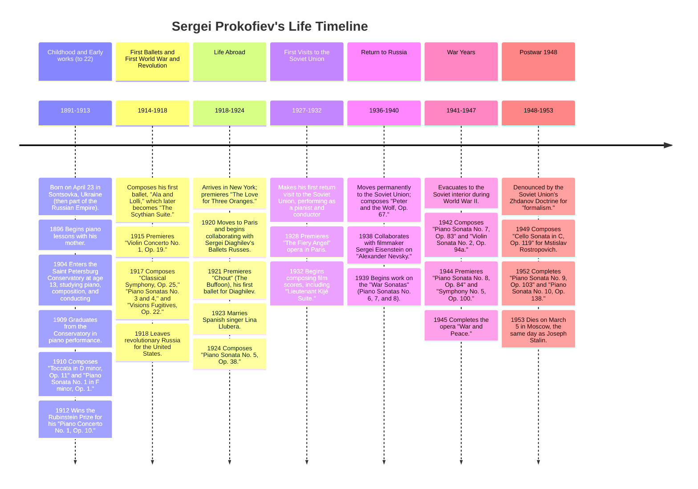

# Prokofiev Sonata and Life

## Piano Sonatas

- Piano Sonata No. 1 in F minor, Op. 1 (1912)
- Piano Sonata No. 2 in D minor, Op. 14 (1912)
- Piano Sonata No. 3 in A minor, Op. 28 (1917)
- Piano Sonata No. 4 in F minor, Op. 29 (1917)
- Piano Sonata No. 5 in G minor, Op. 38 (1923)
- Piano Sonata No. 6 in A major, Op. 82 (1939)
- Piano Sonata No. 7 in B flat major, Op. 83 (1942) (War Sonata)
- Piano Sonata No. 8 in B flat major, Op. 84 (1944) (War Sonata)
- Piano Sonata No. 9 in F major, Op. 103 (1947) (War Sonata)
- Piano Sonata No. 10 in B flat major, Op. 138 (1952)

## Violin Sonatas

- Violin Sonata No. 1 in F minor, Op. 80 (1946)
- Violin Sonata No. 2 in D major, Op. 94a (1942) - Originally written for flute and piano, later arranged for violin.
- Violin Sonata No. 3 in E flat major, Op. 115 (1949)

## Cello Sonatas

- Cello Sonata in C, Op. 119 (1949)
- Cello Sonata in F, Op. 143 (1950)

## Other Notable Sonatas

- Sonata for Flute and Piano in D major, Op. 94 (1942) - Originally for flute and piano, often performed with other instruments.
- Sonata for Two Violins, Op. 56 (1932)

## Prokofiev life

